# Restaurant Point of Sale

Homer's Pub (Restaurant Point of Sale) - web application for managing orders and tracking restaurant statistics. The project was developed using React, Redux Toolkit, Tailwind CSS, Firebase Realtime Database and React Router. The following were also applied: Node.js, Git/Github.

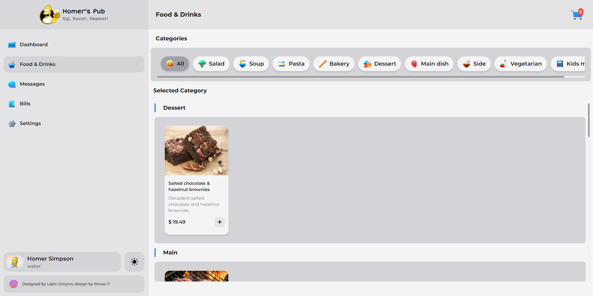


## Main functions
- **Order management:** Adding, deleting and editing orders.
- **Statistics:** Tracks total revenue and number of dishes purchased.
- **Interface for employees:** Separate interface for employees with different access roles.
- **Payment system:** Possibility of specifying the payment method for each order.
- **Reports:** Generation of reports and analysis of statistics.
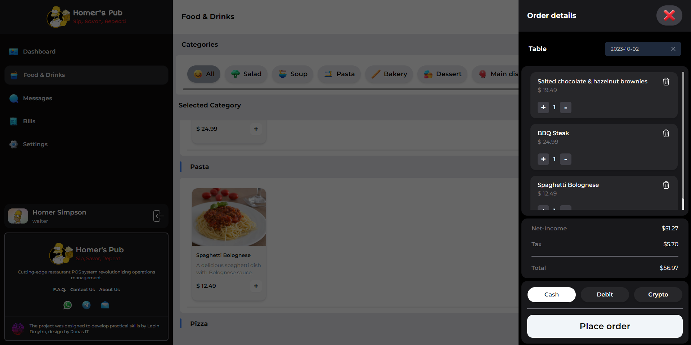
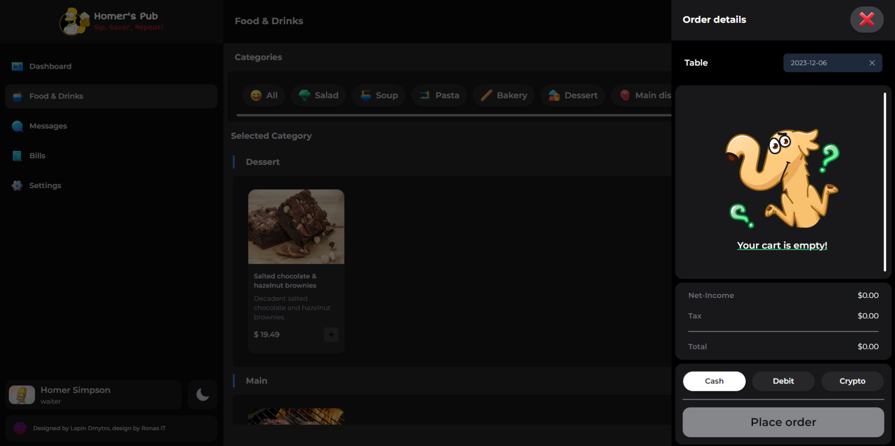
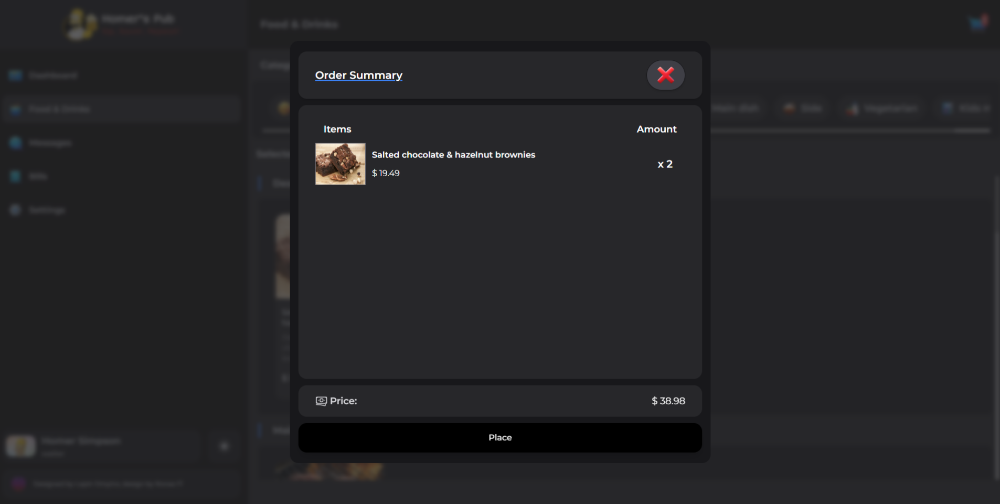

## Mobile design
- **Food Catalog:** That is main food catalog in mobile resolution.
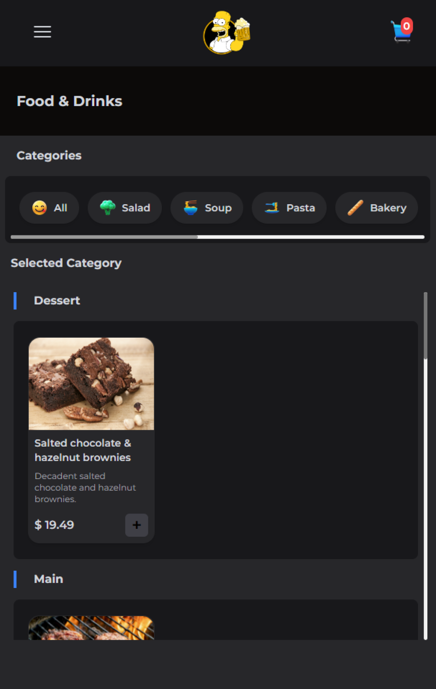
- **Order Summary:** That is order summary in mobile resolution.
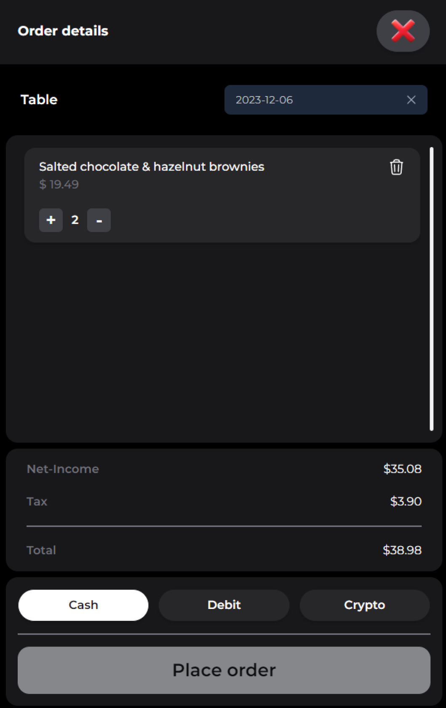
- **Menu:** That is order summary in mobile resolution.
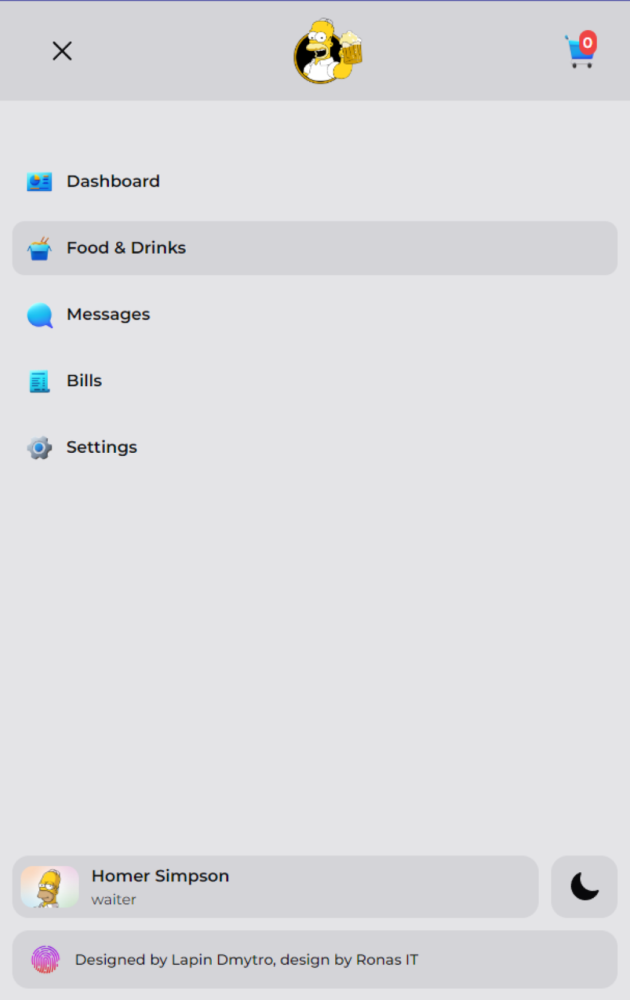
- **Menu:** That is order summary in mobile resolution.
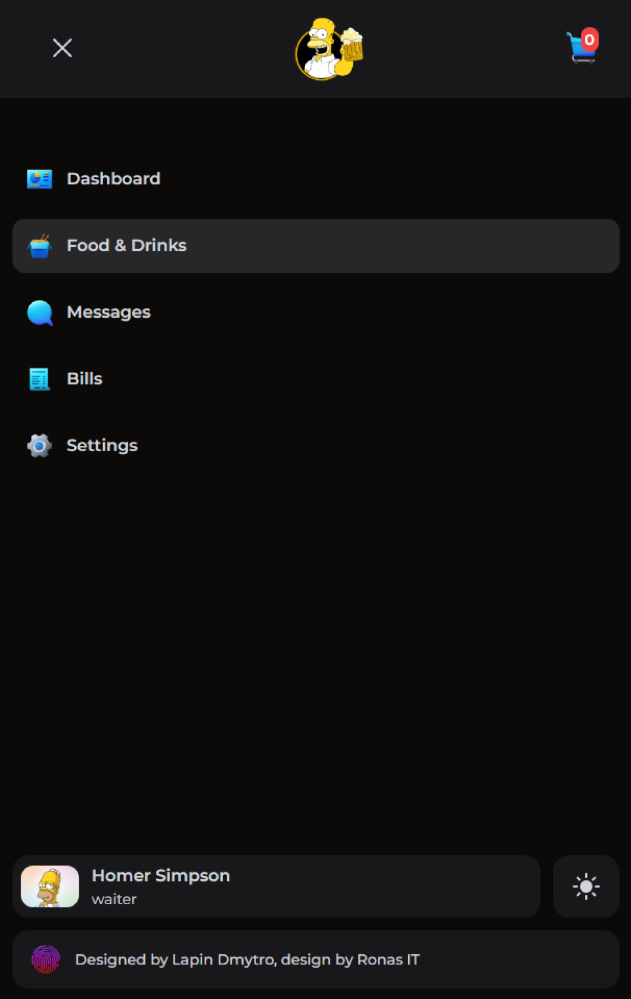

## Settings page
- **Settings:** Settings page with exact tabs.
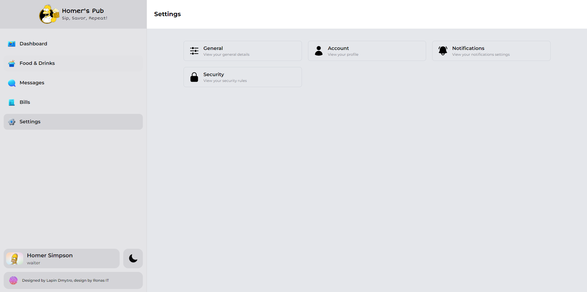
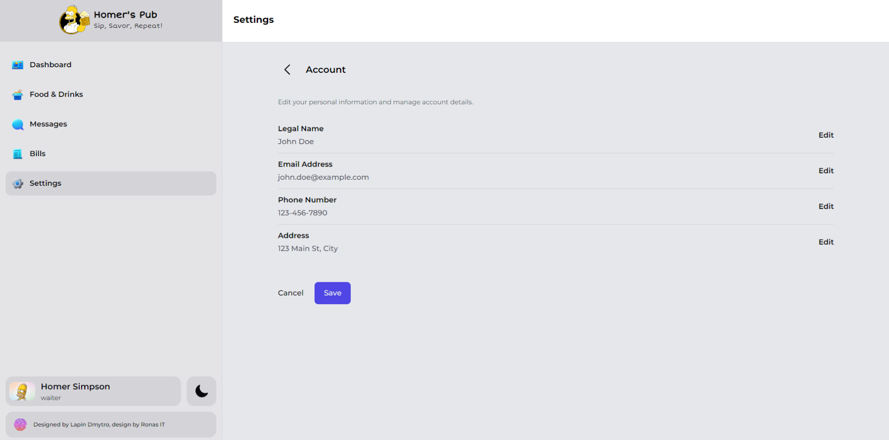
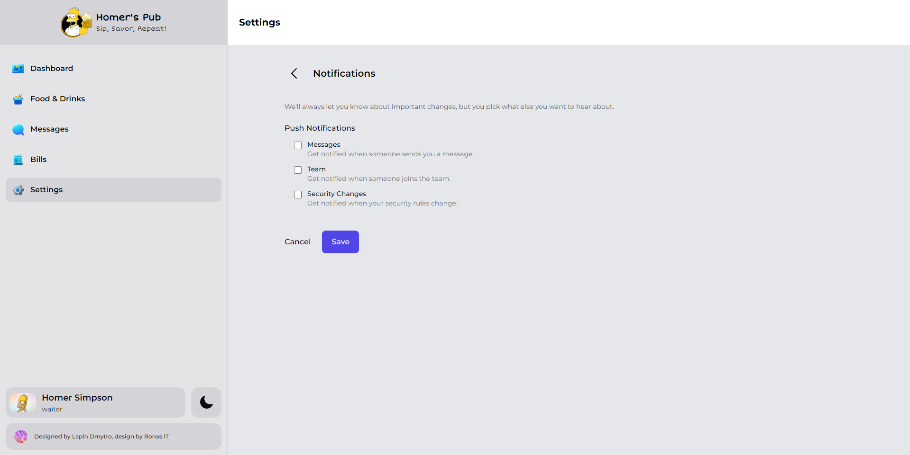


## Installation

1. Clone repo:

```bash
git clone https://github.com/dmitry-lapin/restaurant-pos.git
