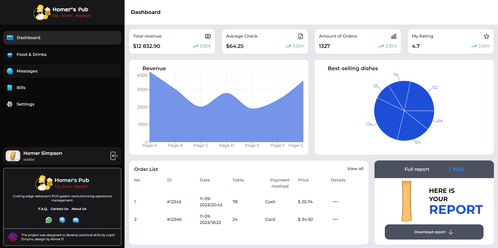

# Restaurant Point of Sale

GodDish POS - web application for managing orders and tracking restaurant statistics. The project was developed using React, Redux Toolkit, Tailwind CSS, Firebase Realtime Database and React Router.


## Main functions
- **Order management:** Adding, deleting and editing orders.
- **Statistics:** Tracks total revenue and number of dishes purchased.
- **Interface for employees:** Separate interface for employees with different access roles.
- **Payment system:** Possibility of specifying the payment method for each order.
- **Reports:** Generation of reports and analysis of statistics.


## Installation

1. Clone repo:

```bash
git clone https://github.com/dmitry-lapin/restaurant-pos.git
